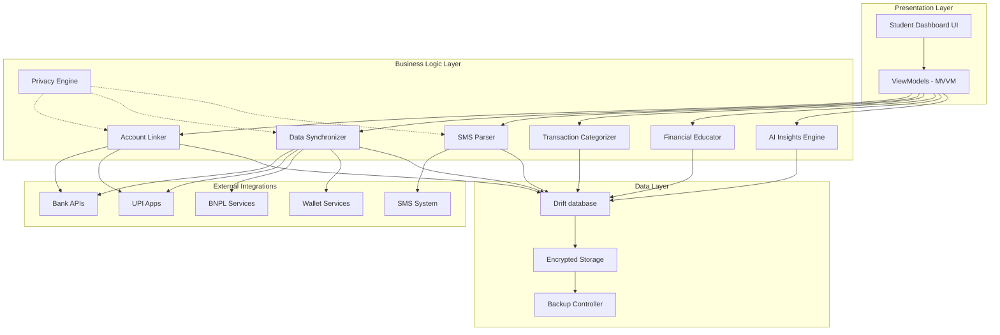

# Design Document: DuskSpendr AI Finance Buddy

## Overview

DuskSpendr is a privacy-first AI Finance Buddy designed specifically for students to comprehensively track expenses through secure bank and UPI account linking with automatic data synchronization. The system employs a clean architecture approach with MVVM pattern, ensuring all sensitive data processing occurs on-device while providing intelligent financial insights and education.

The application integrates with major Indian financial institutions and payment platforms, offering a Zerodha-like account linking experience with robust data synchronization capabilities. The design prioritizes student-specific needs including pocket money management, shared expenses, and financial literacy education.

## Architecture

### High-Level Architecture



### Clean Architecture Layers

**Presentation Layer (UI/MVVM)**
- Student Dashboard with youth-friendly interface
- ViewModels managing UI state and business logic coordination
- Data binding for reactive UI updates
- Navigation components for seamless user experience

**Domain Layer (Business Logic)**
- Use cases for each major feature (linking, syncing, categorizing)
- Business rules and validation logic
- Domain models representing core entities
- Repository interfaces for data access abstraction

**Data Layer**
- Drift database for local encrypted storage
- Repository implementations
- Data sources for external API integration
- Backup and recovery mechanisms

## Components and Interfaces

### 1. Account Linker Component

**Purpose**: Manages secure connections to external financial accounts using Zerodha-like authentication flow.

**Key Interfaces**:
```kotlin
interface AccountLinker {
    suspend fun linkBankAccount(bankId: String, credentials: SecureCredentials): LinkResult
    suspend fun linkUPIApp(upiProvider: UPIProvider, authToken: String): LinkResult
    suspend fun linkWalletService(walletType: WalletType, authData: AuthData): LinkResult
    suspend fun linkBNPLService(bnplProvider: BNPLProvider, authData: AuthData): LinkResult
    suspend fun unlinkAccount(accountId: String): UnlinkResult
    suspend fun refreshAccountConnection(accountId: String): RefreshResult
    fun getLinkedAccounts(): Flow<List<LinkedAccount>>
}

data class LinkedAccount(
    val id: String,
    val type: AccountType,
    val provider: String,
    val displayName: String,
    val isActive: Boolean,
    val lastSyncTime: Instant,
    val balance: Money?
)
```

**Supported Integrations**:
- **Banks**: SBI, HDFC, ICICI, Axis Bank via secure API connections
- **UPI Apps**: Google Pay, PhonePe, Paytm via OAuth-like flows
- **Wallets**: Amazon Pay, Paytm Wallet via API integration
- **BNPL**: LazyPay, Simpl, Amazon Pay Later via secure connections

**Security Features**:
- OAuth 2.0 / OpenID Connect for authentication
- Token-based session management
- Encrypted credential storage
- Automatic token refresh mechanisms
- Secure unlinking with complete data removal

### 2. Data Synchronizer Component

**Purpose**: Automatically captures and synchronizes transaction data from all linked accounts.

**Key Interfaces**:
```kotlin
interface DataSynchronizer {
    suspend fun syncAllAccounts(): SyncResult
    suspend fun syncAccount(accountId: String): SyncResult
    suspend fun enableRealTimeSync(accountId: String): Boolean
    suspend fun handleUPINotification(notification: UPINotification): ProcessResult
    fun getSyncStatus(): Flow<Map<String, SyncStatus>>
    suspend fun resolveDuplicateTransactions(duplicates: List<Transaction>): List<Transaction>
}

data class SyncResult(
    val accountId: String,
    val transactionsAdded: Int,
    val transactionsUpdated: Int,
    val duplicatesFound: Int,
    val errors: List<SyncError>,
    val lastSyncTime: Instant
)
```

**Synchronization Features**:
- Real-time UPI notification processing (< 5 minutes)
- Batch synchronization for bank transactions
- Duplicate detection and prevention
- Automatic balance updates
- Subscription payment pattern recognition
- Error handling and retry mechanisms

### 3. SMS Parser Component (Privacy-First)

**Purpose**: Processes SMS notifications on-device to extract transaction information while maintaining complete privacy.

**Key Interfaces**:
```kotlin
interface SMSParser {
    suspend fun processSMSMessage(message: SMSMessage): ParseResult
    suspend fun extractTransactionData(message: SMSMessage): Transaction?
    suspend fun detectSpamSMS(message: SMSMessage): Boolean
    suspend fun identifyFinancialInstitution(sender: String): FinancialInstitution?
    fun getProcessingStats(): SMSProcessingStats
}

data class SMSMessage(
    val sender: String,
    val content: String,
    val timestamp: Instant,
    val isFromVerifiedSender: Boolean
)

data class ParseResult(
    val transaction: Transaction?,
    val isSpam: Boolean,
    val confidence: Float,
    val extractedData: Map<String, Any>
)
```

**Privacy Features**:
- 100% on-device processing - no raw SMS data leaves the device
- Verified sender whitelist for financial institutions
- Spam and fake SMS detection algorithms
- Only processed transaction data stored, not raw messages
- Transparent data processing reporting

### 4. Transaction Categorizer Component

**Purpose**: Automatically categorizes expenses using AI-powered merchant recognition and pattern analysis.

**Key Interfaces**:
```kotlin
interface TransactionCategorizer {
    suspend fun categorizeTransaction(transaction: Transaction): CategoryResult
    suspend fun suggestCategory(merchantName: String, amount: Money): List<CategorySuggestion>
    suspend fun learnFromUserCorrection(transaction: Transaction, correctCategory: Category)
    suspend fun createCustomCategory(name: String, rules: List<CategoryRule>): Category
    fun getCategoryAccuracy(): Float
}

data class CategoryResult(
    val category: Category,
    val confidence: Float,
    val reasoning: String,
    val alternativeCategories: List<CategorySuggestion>
)

enum class Category {
    FOOD, TRANSPORTATION, ENTERTAINMENT, EDUCATION, SHOPPING, 
    UTILITIES, HEALTHCARE, SUBSCRIPTIONS, INVESTMENTS, LOANS, 
    SHARED_EXPENSES, POCKET_MONEY, CUSTOM
}
```

**Categorization Features**:
- Machine learning-based merchant recognition
- Pattern analysis for recurring transactions
- User feedback learning system
- Custom category creation
- Confidence scoring for suggestions
- Student-specific category presets

### 5. Privacy Engine Component

**Purpose**: Ensures all sensitive data processing occurs on-device with comprehensive privacy protection.

**Key Interfaces**:
```kotlin
interface PrivacyEngine {
    fun validateDataProcessing(operation: DataOperation): PrivacyValidation
    fun encryptSensitiveData(data: Any): EncryptedData
    fun decryptSensitiveData(encryptedData: EncryptedData): Any
    fun auditDataAccess(component: String, dataType: DataType): AuditResult
    fun generatePrivacyReport(): PrivacyReport
}

data class PrivacyValidation(
    val isAllowed: Boolean,
    val reason: String,
    val requiredPermissions: List<Permission>,
    val dataMinimizationSuggestions: List<String>
)
```

**Privacy Features**:
- On-device encryption for all sensitive data
- Data minimization principles
- Audit trail for data access
- Privacy-compliant data processing validation
- Transparent privacy reporting
- Secure data deletion capabilities

### 6. Financial Educator Component

**Purpose**: Provides personalized financial education content and insights for students.

**Key Interfaces**:
```kotlin
interface FinancialEducator {
    suspend fun generatePersonalizedTips(spendingPattern: SpendingPattern): List<FinancialTip>
    suspend fun assessFinancialHealth(userId: String): FinancialHealthScore
    suspend fun suggestImprovements(weakAreas: List<FinancialArea>): List<Improvement>
    suspend fun getEducationalContent(topic: FinancialTopic): EducationalContent
    suspend fun celebrateAchievement(achievement: FinancialAchievement): Celebration
}

data class FinancialHealthScore(
    val overall: Int, // 0-100
    val budgetingScore: Int,
    val savingsScore: Int,
    val spendingDiscipline: Int,
    val financialLiteracy: Int,
    val improvements: List<String>
)
```

## Data Models

### Core Transaction Model

```kotlin
@Entity(tableName = "transactions")
data class Transaction(
    @PrimaryKey val id: String,
    val accountId: String,
    val amount: Money,
    val description: String,
    val merchantName: String?,
    val category: Category,
    val subcategory: String?,
    val timestamp: Instant,
    val type: TransactionType,
    val paymentMethod: PaymentMethod,
    val isRecurring: Boolean,
    val recurringPattern: RecurringPattern?,
    val location: Location?,
    val isSharedExpense: Boolean,
    val sharedWith: List<String>,
    val tags: List<String>,
    val notes: String?,
    val confidence: Float,
    val source: DataSource,
    val rawData: String? // Encrypted
)

enum class TransactionType {
    DEBIT, CREDIT, TRANSFER, INVESTMENT, LOAN_PAYMENT, 
    BILL_PAYMENT, CASH_WITHDRAWAL, REFUND
}

enum class PaymentMethod {
    UPI, DEBIT_CARD, CREDIT_CARD, NET_BANKING, WALLET, 
    BNPL, CASH, BANK_TRANSFER
}
```

### Account Balance Model

```kotlin
@Entity(tableName = "account_balances")
data class AccountBalance(
    @PrimaryKey val accountId: String,
    val currentBalance: Money,
    val availableBalance: Money,
    val lastUpdated: Instant,
    val balanceHistory: List<BalanceSnapshot>,
    val lowBalanceThreshold: Money?,
    val isActive: Boolean
)

data class BalanceSnapshot(
    val balance: Money,
    val timestamp: Instant,
    val source: String
)
```

### Budget and Goals Model

```kotlin
@Entity(tableName = "budgets")
data class Budget(
    @PrimaryKey val id: String,
    val userId: String,
    val name: String,
    val category: Category?,
    val amount: Money,
    val period: BudgetPeriod,
    val startDate: LocalDate,
    val endDate: LocalDate?,
    val spent: Money,
    val remaining: Money,
    val alertThreshold: Float, // 0.0 to 1.0
    val isActive: Boolean,
    val notifications: List<BudgetNotification>
)

enum class BudgetPeriod {
    DAILY, WEEKLY, MONTHLY, CUSTOM
}
```

### Shared Expense Model

```kotlin
@Entity(tableName = "shared_expenses")
data class SharedExpense(
    @PrimaryKey val id: String,
    val transactionId: String,
    val groupName: String,
    val totalAmount: Money,
    val paidBy: String,
    val participants: List<Participant>,
    val splitType: SplitType,
    val isSettled: Boolean,
    val settlementDate: Instant?,
    val notes: String?
)

data class Participant(
    val userId: String,
    val name: String,
    val share: Money,
    val hasPaid: Boolean,
    val paidAmount: Money?
)

enum class SplitType {
    EQUAL, PERCENTAGE, EXACT_AMOUNT, CUSTOM
}
```

## Correctness Properties

*A property is a characteristic or behavior that should hold true across all valid executions of a system—essentially, a formal statement about what the system should do. Properties serve as the bridge between human-readable specifications and machine-verifiable correctness guarantees.*

The following properties were identified from the acceptance criteria:

### Property Reflection

After analyzing all acceptance criteria, I identified several properties that can be consolidated to eliminate redundancy:

**Consolidation Decisions:**
- Properties 1.1-1.4 (bank, UPI, wallet, BNPL support) can be combined into a single comprehensive account linking property
- Properties 2.2-2.3 (UPI and SMS notification processing) can be combined into a general notification processing property
- Properties 3.2, 3.3, 3.5 (SMS privacy and filtering) can be combined into a comprehensive SMS privacy property
- Properties 16.1-16.2 (data encryption and persistence) can be combined into a data storage property

### Core Correctness Properties

**Property 1: Account Linking Support**
*For any* supported financial service provider (banks: SBI, HDFC, ICICI, Axis Bank; UPI: Google Pay, PhonePe, Paytm; wallets: Amazon Pay, Paytm Wallet; BNPL: LazyPay, Simpl, Amazon Pay Later), the Account_Linker should successfully handle connection requests and establish secure links
**Validates: Requirements 1.1, 1.2, 1.3, 1.4**

**Property 2: Complete Account Unlinking**
*For any* linked account, when unlinking is performed, all associated data (transactions, balances, settings, cached information) should be completely removed from the system
**Validates: Requirements 1.6**

**Property 3: Notification Processing Consistency**
*For any* valid financial notification (UPI or SMS), the system should extract transaction information and update the local database with consistent data structure and timing
**Validates: Requirements 2.2, 2.3**

**Property 4: Automatic Transaction Categorization**
*For any* synchronized transaction, the Transaction_Categorizer should assign an appropriate expense category based on merchant patterns and transaction characteristics
**Validates: Requirements 2.4**

**Property 5: Recurring Payment Detection**
*For any* sequence of transactions with similar amounts, merchants, and timing patterns, the Data_Synchronizer should identify and track them as recurring payments
**Validates: Requirements 2.5**

**Property 6: Duplicate Transaction Prevention**
*For any* set of transactions with identical or highly similar characteristics (amount, timestamp, merchant, account), only unique transactions should be stored in the expense records
**Validates: Requirements 2.6**

**Property 7: SMS Privacy and Filtering**
*For any* SMS message processed by the system, only messages from verified financial institutions should be processed, spam messages should be filtered out, and only processed transaction data (not raw message content) should be stored
**Validates: Requirements 3.2, 3.3, 3.5**

**Property 8: Balance Extraction from SMS**
*For any* bank balance SMS notification from a verified sender, the SMS_Parser should accurately extract balance information and update the corresponding account balance
**Validates: Requirements 10.1**

**Property 9: Encrypted Data Storage**
*For any* financial data (transactions, balances, account information), the system should store it in encrypted format in local database storage and immediately persist new transactions upon processing
**Validates: Requirements 16.1, 16.2**

## Error Handling

### Account Linking Errors

**Connection Failures**:
- Network timeout handling with exponential backoff
- Invalid credential detection and user feedback
- Service unavailability graceful degradation
- Token expiration automatic refresh

**Authentication Errors**:
- Multi-factor authentication support
- Biometric fallback mechanisms
- Session management and security
- Fraud detection integration

### Data Synchronization Errors

**Sync Failures**:
- Partial sync recovery mechanisms
- Conflict resolution for competing updates
- Data integrity validation
- Automatic retry with circuit breaker pattern

**Data Quality Issues**:
- Malformed transaction handling
- Missing field validation and defaults
- Currency conversion error handling
- Timestamp normalization

### SMS Processing Errors

**Parsing Failures**:
- Unrecognized message format handling
- Incomplete transaction data management
- Sender verification failures
- Character encoding issues

**Privacy Violations**:
- Unauthorized data access prevention
- Encryption failure handling
- Data leak detection and response
- Audit trail maintenance

### Storage and Backup Errors

**Database Errors**:
- Corruption detection and recovery
- Storage space management
- Migration failure handling
- Backup integrity validation

**Security Errors**:
- Encryption key management
- Unauthorized access prevention
- Data breach response procedures
- Secure deletion verification

## Testing Strategy

### Dual Testing Approach

The DuskSpendr system requires comprehensive testing through both unit tests and property-based tests to ensure correctness and reliability:

**Unit Tests**: Focus on specific examples, edge cases, and error conditions
- Account linking with specific providers
- SMS parsing for known message formats
- Budget calculation edge cases
- Error handling scenarios
- Integration points between components

**Property-Based Tests**: Verify universal properties across all inputs
- Account linking behavior across all supported providers
- Transaction categorization accuracy across diverse merchants
- Data encryption consistency for all financial data
- SMS privacy compliance across all message types
- Duplicate detection effectiveness across transaction variations

### Property-Based Testing Configuration

**Testing Framework**: Use Kotest Property Testing for Kotlin implementation
- Minimum 100 iterations per property test for statistical confidence
- Custom generators for financial data (amounts, dates, merchant names)
- Shrinking support for minimal failing examples
- Seed-based reproducible test runs

**Test Tagging Format**:
Each property-based test must include a comment with the format:
```kotlin
// Feature: DuskSpendr-app, Property 1: Account Linking Support
```

**Property Test Implementation Requirements**:
- Each correctness property maps to exactly one property-based test
- Tests must validate the universal quantification ("for any" statements)
- Custom generators for domain-specific data types (Money, Transaction, Account)
- Comprehensive edge case coverage through property testing
- Integration with CI/CD pipeline for continuous validation

### Testing Coverage Areas

**Core Functionality Testing**:
- Account linking and unlinking processes
- Transaction synchronization and categorization
- SMS parsing and privacy compliance
- Budget tracking and alert systems
- Shared expense calculations

**Security and Privacy Testing**:
- Data encryption verification
- On-device processing validation
- Privacy compliance testing
- Secure deletion verification
- Authentication and authorization

**Performance and Reliability Testing**:
- Large dataset handling
- Memory usage optimization
- Battery consumption monitoring
- Network failure resilience
- Database performance under load

**Student-Specific Feature Testing**:
- Pocket money tracking accuracy
- Educational content delivery
- Gamification score calculations
- Social feature privacy protection
- Age-appropriate interface validation

The testing strategy ensures that DuskSpendr maintains high quality, security, and reliability while serving the specific needs of student users in the Indian financial ecosystem.