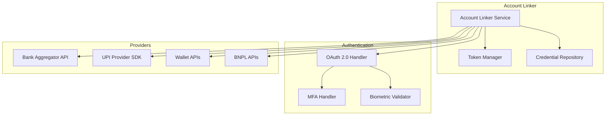

# Spec 2: Account Linking System

## Overview

This specification covers the secure account linking system that connects DuskSpendr to banks, UPI apps, wallets, and BNPL services using a Zerodha-like authentication experience.

**Priority:** P0 (Core Feature)  
**Estimated Effort:** 4 sprints  
**Dependencies:** Spec 1 (Core Infrastructure)

---

## Goals

1. Enable secure linking of major Indian bank accounts
2. Integrate with popular UPI payment apps
3. Connect digital wallet services
4. Support Buy Now Pay Later (BNPL) services
5. Provide seamless account management experience

---

## Supported Providers

### Banks (P0)
- State Bank of India (SBI)
- HDFC Bank
- ICICI Bank
- Axis Bank

### UPI Apps (P0-P1)
- Google Pay
- PhonePe
- Paytm

### Wallets (P1)
- Amazon Pay
- Paytm Wallet

### BNPL Services (P2)
- LazyPay
- Simpl
- Amazon Pay Later

---

## Technical Architecture



---

## Tickets

### SS-010: Design Account Linker interface and architecture
**Priority:** P0 | **Points:** 3

**Description:**
Design the Account Linker component architecture following the interface defined in design.md.

**Acceptance Criteria:**
- [ ] Finalize AccountLinker interface
- [ ] Define LinkResult, UnlinkResult, RefreshResult types
- [ ] Create provider abstraction layer
- [ ] Design error handling strategy
- [ ] Document authentication flow diagrams
- [ ] Create sequence diagrams for linking flows

**Interface:**
```kotlin
interface AccountLinker {
    suspend fun linkBankAccount(bankId: String, credentials: SecureCredentials): LinkResult
    suspend fun linkUPIApp(upiProvider: UPIProvider, authToken: String): LinkResult
    suspend fun linkWalletService(walletType: WalletType, authData: AuthData): LinkResult
    suspend fun linkBNPLService(bnplProvider: BNPLProvider, authData: AuthData): LinkResult
    suspend fun unlinkAccount(accountId: String): UnlinkResult
    suspend fun refreshAccountConnection(accountId: String): RefreshResult
    fun getLinkedAccounts(): Flow<List<LinkedAccount>>
}
```

**Dependencies:** Spec 1 complete

---

### SS-011: Implement OAuth 2.0 authentication flow
**Priority:** P0 | **Points:** 8

**Description:**
Build generic OAuth 2.0 / OpenID Connect authentication handler for provider integrations.

**Acceptance Criteria:**
- [ ] Implement OAuth 2.0 authorization code flow
- [ ] Handle PKCE for public clients
- [ ] Build token refresh mechanism
- [ ] Implement secure token storage
- [ ] Handle MFA challenges
- [ ] Create deeplink callback handler
- [ ] Support custom URL schemes
- [ ] Handle token expiration gracefully

**Technical Notes:**
- Use AppAuth library as base
- Store tokens in EncryptedSharedPreferences
- Implement token auto-refresh before expiration

**Dependencies:** SS-010

---

### SS-012: Integrate SBI bank account linking
**Priority:** P0 | **Points:** 8

**Description:**
Implement SBI bank account connection via Open Banking API or account aggregator.

**Acceptance Criteria:**
- [ ] Research SBI Open Banking / AA integration
- [ ] Implement SBI-specific authentication flow
- [ ] Handle SBI transaction fetch API
- [ ] Map SBI transaction format to app model
- [ ] Test with sandbox/test accounts
- [ ] Handle SBI-specific error codes
- [ ] Document integration requirements

**Technical Notes:**
- May require Account Aggregator (AA) license
- Consider using Setu/Finvu AA framework

**Dependencies:** SS-011

---

### SS-013: Integrate HDFC bank account linking
**Priority:** P0 | **Points:** 8

**Description:**
Implement HDFC bank account connection via their API or account aggregator.

**Acceptance Criteria:**
- [ ] Research HDFC Open Banking / AA integration
- [ ] Implement HDFC-specific authentication flow
- [ ] Handle HDFC transaction fetch API
- [ ] Map HDFC transaction format to app model
- [ ] Test with sandbox/test accounts
- [ ] Handle HDFC-specific error codes

**Dependencies:** SS-011

---

### SS-014: Integrate ICICI bank account linking
**Priority:** P1 | **Points:** 5

**Description:**
Implement ICICI bank account connection via their API or account aggregator.

**Acceptance Criteria:**
- [ ] Research ICICI Open Banking / AA integration
- [ ] Implement ICICI-specific authentication flow
- [ ] Handle ICICI transaction fetch API
- [ ] Map ICICI transaction format to app model
- [ ] Test with sandbox/test accounts

**Dependencies:** SS-011

---

### SS-015: Integrate Axis Bank account linking
**Priority:** P1 | **Points:** 5

**Description:**
Implement Axis Bank account connection via their API or account aggregator.

**Acceptance Criteria:**
- [ ] Research Axis Open Banking / AA integration
- [ ] Implement Axis-specific authentication flow
- [ ] Handle Axis transaction fetch API
- [ ] Map Axis transaction format to app model
- [ ] Test with sandbox/test accounts

**Dependencies:** SS-011

---

### SS-016: Implement Google Pay UPI integration
**Priority:** P0 | **Points:** 8

**Description:**
Integrate Google Pay for UPI transaction syncing and balance access.

**Acceptance Criteria:**
- [ ] Research Google Pay API availability
- [ ] Implement Google OAuth sign-in
- [ ] Fetch UPI transaction history
- [ ] Handle real-time UPI notifications
- [ ] Map GPay transaction format
- [ ] Test with real/sandbox account
- [ ] Handle GPay-specific errors

**Technical Notes:**
- May need to rely on SMS parsing as backup
- Google Pay may have limited API access

**Dependencies:** SS-011

---

### SS-017: Implement PhonePe UPI integration
**Priority:** P0 | **Points:** 8

**Description:**
Integrate PhonePe for UPI transaction syncing.

**Acceptance Criteria:**
- [ ] Research PhonePe API / SDK availability
- [ ] Implement PhonePe authentication
- [ ] Fetch UPI transaction history
- [ ] Handle PhonePe notifications
- [ ] Map transaction format
- [ ] Test integration

**Dependencies:** SS-011

---

### SS-018: Implement Paytm UPI integration
**Priority:** P1 | **Points:** 5

**Description:**
Integrate Paytm for UPI transaction syncing.

**Acceptance Criteria:**
- [ ] Research Paytm API availability
- [ ] Implement Paytm OAuth flow
- [ ] Fetch UPI transaction history
- [ ] Map transaction format
- [ ] Test integration

**Dependencies:** SS-011

---

### SS-019: Integrate Amazon Pay wallet
**Priority:** P1 | **Points:** 5

**Description:**
Integrate Amazon Pay wallet for transaction tracking.

**Acceptance Criteria:**
- [ ] Research Amazon Pay API
- [ ] Implement Amazon Login
- [ ] Fetch wallet transaction history
- [ ] Track wallet balance
- [ ] Map transaction format

**Dependencies:** SS-011

---

### SS-020: Integrate Paytm Wallet
**Priority:** P1 | **Points:** 5

**Description:**
Integrate Paytm Wallet for wallet transaction tracking.

**Acceptance Criteria:**
- [ ] Implement Paytm wallet-specific flow
- [ ] Fetch wallet transactions (separate from UPI)
- [ ] Track wallet balance
- [ ] Map transaction format

**Dependencies:** SS-018

---

### SS-021: Integrate LazyPay BNPL service
**Priority:** P2 | **Points:** 5

**Description:**
Integrate LazyPay Buy Now Pay Later service.

**Acceptance Criteria:**
- [ ] Research LazyPay API
- [ ] Implement LazyPay authentication
- [ ] Fetch BNPL transactions
- [ ] Track credit limit and due payments
- [ ] Set up payment reminders

**Dependencies:** SS-011

---

### SS-022: Integrate Simpl BNPL service
**Priority:** P2 | **Points:** 5

**Description:**
Integrate Simpl Buy Now Pay Later service.

**Acceptance Criteria:**
- [ ] Research Simpl API
- [ ] Implement authentication
- [ ] Fetch BNPL transactions
- [ ] Track credit limit and dues

**Dependencies:** SS-011

---

### SS-023: Integrate Amazon Pay Later BNPL
**Priority:** P2 | **Points:** 5

**Description:**
Integrate Amazon Pay Later BNPL service.

**Acceptance Criteria:**
- [ ] Extend Amazon Pay integration
- [ ] Fetch Pay Later transactions
- [ ] Track credit limit and dues
- [ ] Set up EMI tracking

**Dependencies:** SS-019

---

### SS-024: Implement account unlinking with data cleanup
**Priority:** P0 | **Points:** 5

**Description:**
Implement secure account unlinking that completely removes all associated data.

**Acceptance Criteria:**
- [ ] Implement unlinkAccount() method
- [ ] Revoke OAuth tokens with provider
- [ ] Delete all linked account data
- [ ] Remove associated transactions
- [ ] Clear cached credentials
- [ ] Update UI state immediately
- [ ] Confirm complete data removal
- [ ] Write tests for data cleanup

**Technical Notes:**
- Must be atomic operation
- Should handle partial failures gracefully

**Dependencies:** SS-010, SS-002

---

### SS-025: Build account management UI
**Priority:** P0 | **Points:** 8

**Description:**
Create the user interface for managing linked accounts.

**Acceptance Criteria:**
- [ ] Design linked accounts list screen
- [ ] Show account status (active, syncing, error)
- [ ] Display last sync time and balance
- [ ] Create "Add Account" flow with provider selection
- [ ] Build account details view
- [ ] Implement unlink confirmation dialog
- [ ] Show sync status indicators
- [ ] Handle loading and error states
- [ ] Make UI responsive and accessible

**Dependencies:** SS-010, SS-024

---

## Verification Plan

### Unit Tests
- OAuth flow state machine tests
- Token refresh logic tests
- Account data mapping tests

### Integration Tests
- Full linking/unlinking cycle per provider
- Token persistence across app restarts
- Concurrent account operations

### Security Tests
- Token storage verification
- OAuth state parameter validation
- Credential leak prevention

---

## Regulatory Considerations

> [!IMPORTANT]
> Account linking to banks may require:
> - Account Aggregator (AA) license compliance
> - RBI data localization requirements
> - Explicit user consent for data access
> - Data retention policies

---

## Definition of Done

- [ ] All P0 and P1 tickets completed
- [ ] At least 2 banks and 2 UPI apps working
- [ ] Account management UI complete
- [ ] Unlinking with full data cleanup verified
- [ ] Security review passed
- [ ] User consent flows implemented
