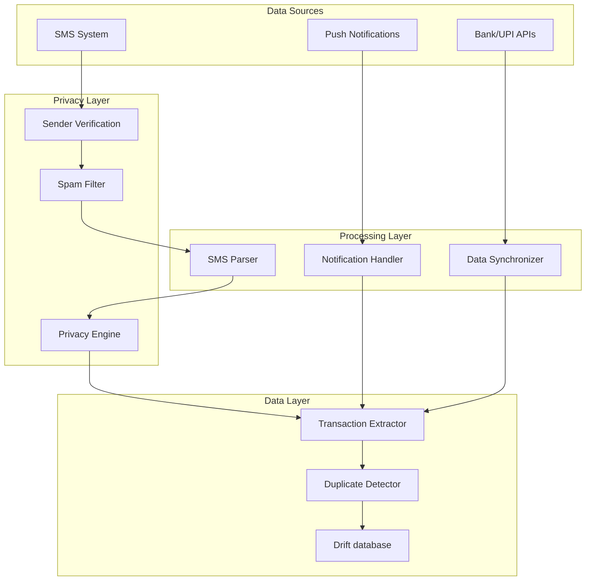

# Spec 3: Data Synchronization & SMS Parsing

## Overview

This specification covers the automatic transaction synchronization from linked accounts and privacy-first SMS parsing for transaction detection without exposing raw SMS data.

**Priority:** P0 (Core Feature)  
**Estimated Effort:** 4 sprints  
**Dependencies:** Spec 1, Spec 2

---

## Goals

1. Enable real-time transaction sync from linked accounts (<5 minutes)
2. Implement 100% on-device SMS parsing with no data leakage
3. Detect and filter spam/fake SMS messages
4. Build robust duplicate transaction prevention
5. Identify subscription and recurring payment patterns

---

## Privacy Guarantees

> [!CAUTION]
> **Critical Privacy Requirements:**
> - Raw SMS content NEVER leaves the device
> - Only extracted transaction data is stored
> - SMS from only verified financial institutions processed
> - User must have clear visibility into what data is stored

---

## Technical Architecture



---

## Tickets

### SS-030: Design Data Synchronizer component
**Priority:** P0 | **Points:** 3

**Description:**
Design the Data Synchronizer architecture following the interface from design.md.

**Acceptance Criteria:**
- [ ] Finalize DataSynchronizer interface
- [ ] Define SyncResult, SyncStatus, SyncError types
- [ ] Design sync scheduling strategy
- [ ] Plan retry and error handling
- [ ] Document sync flow sequences
- [ ] Create technical design document

**Interface:**
```kotlin
interface DataSynchronizer {
    suspend fun syncAllAccounts(): SyncResult
    suspend fun syncAccount(accountId: String): SyncResult
    suspend fun enableRealTimeSync(accountId: String): Boolean
    suspend fun handleUPINotification(notification: UPINotification): ProcessResult
    fun getSyncStatus(): Flow<Map<String, SyncStatus>>
    suspend fun resolveDuplicateTransactions(duplicates: List<Transaction>): List<Transaction>
}
```

**Dependencies:** Spec 2 complete

---

### SS-031: Implement real-time transaction sync (<5 min)
**Priority:** P0 | **Points:** 13

**Description:**
Build the core synchronization engine that keeps transactions updated within 5 minutes of occurrence.

**Acceptance Criteria:**
- [ ] Implement background sync service
- [ ] Schedule periodic sync (configurable interval)
- [ ] React to network connectivity changes
- [ ] Process push notifications for instant sync
- [ ] Handle partial sync failures with retry
- [ ] Implement circuit breaker for failing APIs
- [ ] Track sync metrics (time, success rate)
- [ ] Optimize battery usage during sync
- [ ] Test sync latency meets <5 min requirement

**Technical Notes:**
- Use WorkManager for background scheduling
- Implement exponential backoff for retries
- Consider FCM for server-triggered sync

**Dependencies:** SS-030

---

### SS-032: Build UPI notification handler
**Priority:** P0 | **Points:** 8

**Description:**
Handle UPI payment notifications for instant transaction detection.

**Acceptance Criteria:**
- [ ] Create NotificationListenerService
- [ ] Filter UPI app notifications (GPay, PhonePe, Paytm)
- [ ] Extract transaction data from notification
- [ ] Handle notification variations across UPI apps
- [ ] Parse amount, merchant, transaction ID
- [ ] Trigger immediate database update
- [ ] Handle notification permission requests
- [ ] Test with various UPI notification formats

**Technical Notes:**
- Requires NOTIFICATION_ACCESS permission
- Must handle different notification styles
- Gracefully degrade if permission not granted

**Dependencies:** SS-030

---

### SS-033: Design SMS Parser with on-device processing
**Priority:** P0 | **Points:** 5

**Description:**
Design the SMS Parser component architecture ensuring 100% on-device processing.

**Acceptance Criteria:**
- [ ] Finalize SMSParser interface
- [ ] Define SMSMessage, ParseResult types
- [ ] Design regex/ML parsing strategy
- [ ] Plan sender verification approach
- [ ] Document privacy guarantees
- [ ] Create parsing pipeline architecture

**Interface:**
```kotlin
interface SMSParser {
    suspend fun processSMSMessage(message: SMSMessage): ParseResult
    suspend fun extractTransactionData(message: SMSMessage): Transaction?
    suspend fun detectSpamSMS(message: SMSMessage): Boolean
    suspend fun identifyFinancialInstitution(sender: String): FinancialInstitution?
    fun getProcessingStats(): SMSProcessingStats
}
```

**Dependencies:** Spec 1 complete

---

### SS-034: Implement financial institution sender verification
**Priority:** P0 | **Points:** 8

**Description:**
Build whitelist verification for known financial institution SMS senders.

**Acceptance Criteria:**
- [ ] Create sender ID database for major banks
- [ ] Include UPI app sender IDs
- [ ] Add wallet service sender IDs
- [ ] Handle sender ID variations (short codes, alphanumeric)
- [ ] Support regular expression patterns
- [ ] Implement sender reputation scoring
- [ ] Allow user-reported unknown senders
- [ ] Regular updates mechanism for new senders

**Known Bank Sender Patterns:**
```
SBI: "SBIINB", "SBI", "SBICRD"
HDFC: "HDFCBK", "HDFCBANK"
ICICI: "ICICIB", "ICICI"
Axis: "AXISBK"
GPay: "GOOGLI", "GOOGLE"
PhonePe: "PHPEIN"
Paytm: "PAYTMB"
```

**Dependencies:** SS-033

---

### SS-035: Build spam/fake SMS detection algorithm
**Priority:** P0 | **Points:** 8

**Description:**
Implement spam and fraudulent SMS detection to protect users from fake transactions.

**Acceptance Criteria:**
- [ ] Build rule-based spam detection
- [ ] Detect phishing URL patterns
- [ ] Identify fake bank message patterns
- [ ] Flag suspicious sender IDs
- [ ] Handle lottery/prize scam patterns
- [ ] Detect OTP-stealing message patterns
- [ ] Track detection accuracy metrics
- [ ] Allow user to report false positives
- [ ] Reduce false negative rate below 1%

**Spam Indicators:**
- Urgency keywords ("urgent", "immediately", "expires")
- Suspicious URLs (bit.ly, tinyurl in bank context)
- Request for OTP sharing
- Grammar/spelling errors unusual for banks
- Sender ID mismatch with claimed bank

**Dependencies:** SS-034

---

### SS-036: Create transaction extraction from SMS
**Priority:** P0 | **Points:** 13

**Description:**
Build the core SMS parsing engine to extract transaction details from bank SMS messages.

**Acceptance Criteria:**
- [ ] Parse debit transaction SMS (multiple banks)
- [ ] Parse credit transaction SMS
- [ ] Parse UPI transaction SMS
- [ ] Extract amount with currency handling
- [ ] Extract merchant/payee name
- [ ] Extract account number (masked display)
- [ ] Extract transaction reference number
- [ ] Extract timestamp
- [ ] Handle SMS format variations across banks
- [ ] Achieve >95% parsing accuracy
- [ ] Create comprehensive test suite with real SMS samples

**Sample Patterns:**
```
SBI Debit:
"Your a/c X1234 debited for Rs.500.00 on 04-Feb-26. UPI Ref:1234567890. Avl bal:Rs.5,000.00"

HDFC Credit:
"Rs.1000.00 credited to a/c XX5678 on 04-02-26 by NEFT. Bal:Rs.10,000.00"

UPI:
"Rs.100 sent to amit@ybl via UPI. Ref No 456789. UPI ID: 91XXXXX890@paytm"
```

**Technical Notes:**
- Use combination of regex and heuristics
- Consider TensorFlow Lite for complex patterns
- Store parsing templates for each bank

**Dependencies:** SS-034, SS-035

---

### SS-037: Implement balance extraction from SMS
**Priority:** P0 | **Points:** 8

**Description:**
Extract and track account balance information from bank SMS messages.

**Acceptance Criteria:**
- [ ] Parse available balance from transaction SMS
- [ ] Parse balance inquiry SMS responses
- [ ] Handle "Avl Bal", "Balance", "Bal" variations
- [ ] Extract currency correctly
- [ ] Update account balance in database
- [ ] Track balance history over time
- [ ] Detect balance discrepancies
- [ ] Handle multiple accounts from same bank

**Dependencies:** SS-036

---

### SS-038: Build duplicate transaction detection
**Priority:** P0 | **Points:** 8

**Description:**
Implement robust duplicate detection to prevent the same transaction from being recorded multiple times.

**Acceptance Criteria:**
- [ ] Detect duplicates from same source
- [ ] Handle cross-source duplicates (SMS + API)
- [ ] Use transaction reference number matching
- [ ] Fuzzy matching for slight variations
- [ ] Time window-based detection (within 24 hours)
- [ ] Amount + merchant + time matching
- [ ] Provide merge UI for user resolution
- [ ] Track duplicate detection accuracy
- [ ] Zero false negatives (no missing transactions)

**Duplicate Detection Strategy:**
1. Exact match: Same reference number
2. Strong match: Same amount + merchant + time (±5 min)
3. Weak match: Same amount + similar merchant + time (±1 hour)

**Dependencies:** SS-036

---

### SS-039: Implement subscription/recurring payment detection
**Priority:** P1 | **Points:** 8

**Description:**
Identify recurring payments and subscriptions from transaction patterns.

**Acceptance Criteria:**
- [ ] Detect monthly recurring transactions
- [ ] Detect weekly recurring patterns
- [ ] Identify subscription services (Netflix, Spotify, etc.)
- [ ] Track recurring payment amounts
- [ ] Predict next occurrence date
- [ ] Handle amount variations (±10%)
- [ ] Handle day variations (±3 days)
- [ ] Flag subscription for user confirmation
- [ ] Create subscription management view

**Detection Algorithm:**
- Minimum 2 occurrences for pattern
- Similar amount within tolerance
- Regular time intervals
- Same or similar merchant

**Dependencies:** SS-036

---

### SS-040: Create sync status dashboard UI
**Priority:** P1 | **Points:** 5

**Description:**
Build UI to display synchronization status for all linked accounts.

**Acceptance Criteria:**
- [ ] Show last sync time per account
- [ ] Display sync status (syncing, success, error)
- [ ] Show number of transactions synced
- [ ] Manual refresh button
- [ ] Error details with retry option
- [ ] Overall sync health indicator
- [ ] Notification permission status
- [ ] SMS permission status

**Dependencies:** SS-031

---

### SS-041: Implement batch sync for bank transactions
**Priority:** P1 | **Points:** 8

**Description:**
Build batch synchronization for bank account transaction history.

**Acceptance Criteria:**
- [ ] Fetch historical transactions (up to 90 days)
- [ ] Handle pagination in API responses
- [ ] Process large transaction batches efficiently
- [ ] Show sync progress indicator
- [ ] Resume interrupted sync
- [ ] Handle rate limiting
- [ ] Optimize API calls for battery

**Dependencies:** SS-031

---

## Verification Plan

### Unit Tests
- SMS parsing accuracy tests (100+ real samples)
- Sender verification tests
- Spam detection precision/recall
- Duplicate detection tests
- Balance extraction tests

### Integration Tests
- Full SMS → Transaction flow
- Notification → Sync flow
- API → Database flow
- Cross-source duplicate handling

### Privacy Tests
- Verify no raw SMS in logs
- Verify no raw SMS in database
- Verify no network transmission of SMS
- Audit trail verification

### Performance Tests
- SMS parsing latency (<100ms)
- Sync completion time
- Battery impact measurement
- Memory usage during batch sync

---

## Definition of Done

- [ ] All P0 tickets completed
- [ ] SMS parsing accuracy >95%
- [ ] Spam detection rate >98%
- [ ] Duplicate detection 100% accurate
- [ ] Privacy verification passed
- [ ] Sync latency <5 minutes verified
- [ ] Battery optimization tested
