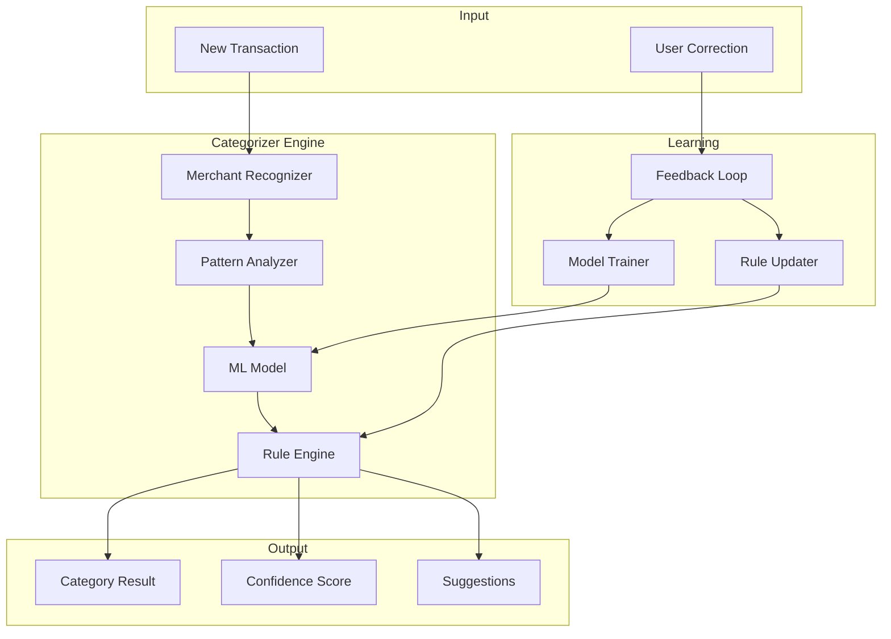

# Spec 4: Transaction Management & Categorization

## Overview

This specification covers the AI-powered expense categorization system and comprehensive transaction management features including search, filtering, and manual entry.

**Priority:** P0 (Core Feature)  
**Estimated Effort:** 3 sprints  
**Dependencies:** Spec 1, Spec 3

---

## Goals

1. Automatically categorize transactions using ML-based merchant recognition
2. Learn from user corrections to improve accuracy over time
3. Provide comprehensive transaction browsing and search
4. Support manual cash expense entry
5. Enable custom category creation for student needs

---

## Category System

### Standard Categories

| Category | Description | Examples |
|----------|-------------|----------|
| 🍕 Food | Food and dining | Swiggy, Zomato, Cafeteria |
| 🚗 Transportation | Travel and commute | Uber, Ola, Metro, Fuel |
| 🎬 Entertainment | Leisure and fun | Movies, Netflix, Gaming |
| 📚 Education | Academic expenses | Books, Courses, Fees |
| 🛍️ Shopping | Retail purchases | Amazon, Myntra, Stores |
| 🏠 Utilities | Bills and services | Electricity, Internet, Phone |
| 🏥 Healthcare | Medical expenses | Pharmacy, Doctor, Hospital |
| 🔄 Subscriptions | Recurring services | Spotify, Prime, Gym |
| 💰 Investments | Savings and growth | FD, Stocks, Mutual Funds |
| 💳 Loans | Debt payments | EMI, Credit Card |
| 👥 Shared | Split expenses | Group meals, Trips |
| 💵 Pocket Money | Transfers from family | Parents, Relatives |
| ✨ Custom | User-defined | Any custom category |

---

## Technical Architecture



---

## Tickets

### SS-050: Design Transaction Categorizer component
**Priority:** P0 | **Points:** 3

**Description:**
Design the Transaction Categorizer architecture following the interface from design.md.

**Acceptance Criteria:**
- [ ] Finalize TransactionCategorizer interface
- [ ] Define CategoryResult, CategorySuggestion types
- [ ] Design ML model requirements
- [ ] Plan rule engine structure
- [ ] Document categorization flow
- [ ] Create accuracy measurement strategy

**Interface:**
```kotlin
interface TransactionCategorizer {
    suspend fun categorizeTransaction(transaction: Transaction): CategoryResult
    suspend fun suggestCategory(merchantName: String, amount: Money): List<CategorySuggestion>
    suspend fun learnFromUserCorrection(transaction: Transaction, correctCategory: Category)
    suspend fun createCustomCategory(name: String, rules: List<CategoryRule>): Category
    fun getCategoryAccuracy(): Float
}
```

**Dependencies:** Spec 3 SMS parsing

---

### SS-051: Implement ML-based merchant recognition
**Priority:** P0 | **Points:** 13

**Description:**
Build machine learning model for merchant name recognition and categorization.

**Acceptance Criteria:**
- [ ] Train text classification model for Indian merchants
- [ ] Include 500+ known merchants in training data
- [ ] Handle merchant name variations/abbreviations
- [ ] Implement on-device inference (TFLite)
- [ ] Achieve >85% accuracy on test set
- [ ] Handle unknown merchants gracefully
- [ ] Support incremental model updates
- [ ] Optimize for mobile inference speed (<50ms)

**Merchant Examples:**
```
"SWIGGY" / "SWGY" / "SWIGGY PVT LTD" → Food
"UBER INDIA" / "UBER*" / "UBER TRIP" → Transportation
"MK RETAIL STORE" → Shopping (generic)
```

**Technical Notes:**
- Use TensorFlow Lite for on-device ML
- Consider BERT-lite or distilled transformer
- Cache merchant → category mappings

**Dependencies:** SS-050

---

### SS-052: Create standard category system
**Priority:** P0 | **Points:** 5

**Description:**
Implement the predefined category system with icons, colors, and metadata.

**Acceptance Criteria:**
- [ ] Define Category enum with all standard categories
- [ ] Assign icons and colors to each category
- [ ] Create category database table
- [ ] Implement category repository
- [ ] Support subcategories (optional)
- [ ] Seed initial category data
- [ ] Localize category names (Hindi, English)

**Category Model:**
```kotlin
data class CategoryInfo(
    val category: Category,
    val displayName: String,
    val icon: String,  // Emoji or icon name
    val color: Color,
    val subcategories: List<String>,
    val isCustom: Boolean
)
```

**Dependencies:** SS-050

---

### SS-053: Build user feedback learning system
**Priority:** P1 | **Points:** 8

**Description:**
Implement system to learn from user corrections and improve categorization over time.

**Acceptance Criteria:**
- [ ] Track user category corrections
- [ ] Update merchant → category mappings
- [ ] Store correction history for learning
- [ ] Recategorize similar past transactions (optional)
- [ ] Show "learned" indicator for merchant
- [ ] Build correction analytics dashboard
- [ ] Improve accuracy with more corrections
- [ ] Handle user correction conflicts

**Learning Strategy:**
1. First correction: Store mapping with low confidence
2. Second correction: Increase confidence
3. Third correction: Apply to all future transactions

**Dependencies:** SS-051

---

### SS-054: Implement custom category creation
**Priority:** P1 | **Points:** 5

**Description:**
Allow users to create custom categories with their own rules.

**Acceptance Criteria:**
- [ ] Custom category creation UI
- [ ] User-selectable icon and color
- [ ] Rule-based auto-categorization
  - Merchant name contains
  - Amount range
  - Description keywords
- [ ] Validate category name uniqueness
- [ ] Allow editing/deleting custom categories
- [ ] Migrate transactions when deleting category

**Dependencies:** SS-052

---

### SS-055: Create transaction list UI with filters
**Priority:** P0 | **Points:** 8

**Description:**
Build the main transaction list view with comprehensive filtering and search.

**Acceptance Criteria:**
- [ ] Display transactions in chronological order
- [ ] Show transaction card with:
  - Category icon and color
  - Merchant name
  - Amount (debit red, credit green)
  - Date and time
  - Account source
- [ ] Filter by date range
- [ ] Filter by category
- [ ] Filter by account source
- [ ] Filter by amount range
- [ ] Search by merchant/description
- [ ] Infinite scroll with pagination
- [ ] Pull-to-refresh
- [ ] Empty state design

**Dependencies:** SS-052

---

### SS-056: Build transaction detail view
**Priority:** P0 | **Points:** 5

**Description:**
Create detailed view for individual transaction with all metadata.

**Acceptance Criteria:**
- [ ] Display all transaction fields
- [ ] Show category with change option
- [ ] Display merchant logo (if available)
- [ ] Show payment method icon
- [ ] Display account name
- [ ] Show reference number
- [ ] Add notes field
- [ ] Add tags capability
- [ ] Mark as shared expense option
- [ ] Delete transaction option
- [ ] Show transaction source (SMS/API/Manual)

**Dependencies:** SS-055

---

### SS-057: Implement manual cash expense entry
**Priority:** P0 | **Points:** 5

**Description:**
Allow users to manually add cash expenses that can't be auto-detected.

**Acceptance Criteria:**
- [ ] Quick add floating action button
- [ ] Amount input with numpad
- [ ] Category selection
- [ ] Date picker (default today)
- [ ] Optional merchant name
- [ ] Optional description/notes
- [ ] Receipt photo capture (optional)
- [ ] Mark as cash payment method
- [ ] Recent categories suggestions
- [ ] Form validation

**Dependencies:** SS-055

---

### SS-058: Create category management UI
**Priority:** P1 | **Points:** 5

**Description:**
Build UI for viewing and managing categories.

**Acceptance Criteria:**
- [ ] List all categories (standard + custom)
- [ ] Show transaction count per category
- [ ] Show total spending per category
- [ ] Create new custom category
- [ ] Edit custom category
- [ ] Delete custom category with migration
- [ ] Reorder categories (optional)
- [ ] Category icon picker
- [ ] Category color picker

**Dependencies:** SS-054

---

### SS-059: Implement category confidence scoring
**Priority:** P1 | **Points:** 5

**Description:**
Show confidence level for auto-categorized transactions and prompt for low confidence.

**Acceptance Criteria:**
- [ ] Calculate confidence score (0.0-1.0)
- [ ] Display confidence indicator on ambiguous transactions
- [ ] Prompt user for confirmation below threshold (0.7)
- [ ] Track confidence accuracy metrics
- [ ] Show confidence in transaction detail
- [ ] Batch review for low confidence transactions

**Confidence Factors:**
- ML model confidence
- Previous corrections for merchant
- Rule match specificity
- Transaction amount typical for category

**Dependencies:** SS-051

---

## Verification Plan

### Unit Tests
- Categorizer accuracy tests with labeled dataset
- Merchant recognition tests (variations)
- Category CRUD operations
- Filter and search logic

### Integration Tests
- Full transaction → category flow
- User correction → learning loop
- Manual entry flow

### ML Model Tests
- Precision and recall per category
- Cross-validation accuracy
- Inference latency benchmarks
- Memory usage during inference

### UI Tests
- Transaction list rendering
- Filter combinations
- Search functionality
- Manual entry flow

---

## Definition of Done

- [ ] ML model achieving >85% accuracy
- [ ] User correction learning verified
- [ ] Transaction list with all filters working
- [ ] Manual entry complete
- [ ] Custom category creation working
- [ ] All UI screens polished
- [ ] Performance optimized (<50ms categorization)
